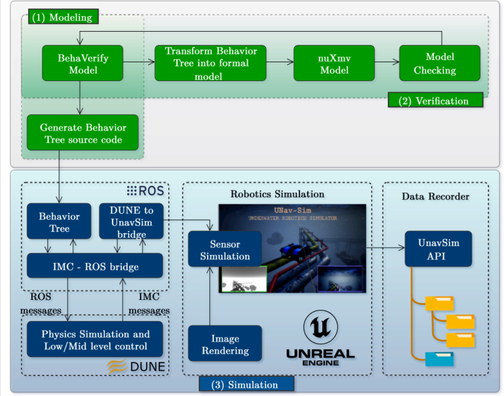
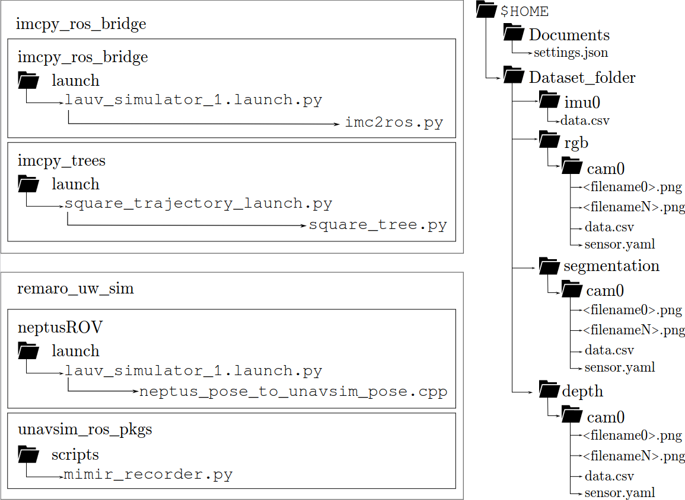

# pipe_inspection_mission
This repository contains the pipeline inspection mission example from our paper [Mission Planning and Safety Assessment for Pipeline Inspection Using Autonomous Underwater Vehicles: A Framework based on Behavior Trees](arxiv.org).

This example repository aims to demonstrate the framework introduced in the paper. A simple example of a squared trajectory is integrated withing the ROS2 packages `imcpy_ros_bridge` and `remaro_uw_sim`.



## Components
- `imcpy_ros_bridge`: A bridge interface between IMC (Interface Message Control), ROS (Robot Operating System), and the behaviour trees, facilitating control, communication and data exchange in the robot mission.
- `remaro_uw_sim`: packages to bridge between UNavSim, ROS and Dune. It also includes a data recording script.

## Installation

### Prerequisites
- LSTS Toolchain components, for controlling the AUV:
  - Dune: for setting the comunication and send commands to the AUV. Installation and usage instructions are available [here](github.com/LSTS/dune/wiki).
  - Neptus: Dune's graphical interface. Installation and usage instructions are available [here](github.com/LSTS/neptus/wiki).
- UNavSim: for simulating realistic renderings of underwater environments, and getting sensor recordings such as camera, segmentation and IMU. Installation instructions available [here](https://github.com/open-airlab/UNav-Sim).
- ROS2. These repos have been tested under ROS2 Foxy and Humble.
- py_trees_ros. Installation instructions available [here](https://github.com/splintered-reality/py_trees_ros).


### Clone the Repository
`imcpy_ros_bridge` and `remaro_uw_sim` are ROS2 stacks (or metapackages, if you prefer). For ROS version compatibility we refer to the documentation from the original repos. You can clone this repository in your colcon workspace to compile these ROS stacks as follows:
```bash
cd $HOME/<path-to-your-colcon-ws>/src
git clone https://github.com/remaro-network/pipe_inspection_mission
cd ..
colcon build
```

## Usage
Here we will demonstrate the usage of the framework with a simple square trajectory example.
The following figure shows, on the left, the ROS2 stacks `imcpy_ros_bridge` and `remaro_uw_sim` pointing to the files within the packages required to run the proposed example. On the right, the file structure that the dataset recorder scrips generates. 



Let's set up an example of UNavSim working with a simulated OMST vehicle in Dune. For that, you will have Dune, Neptus, UNavSim, and this ROS node all working at the same time. In this example I will show you how to run them all one by one.

1. **Dune**

First, cd to your `dune/build` directory and run:

```
./dune -c lauv-simulator-1 -p Simulation
```
2. **Neptus**
Then, from the directory where you cloned Neptus, execute Neptus as follows:

```
./neptus
```
In the Neptus interface, connecto to the `lauv-simulator-1` vehicle to see its state.

3. **UNavSim**

Then, form UNav-Sim, run the simulation in your favourite environment with the `AirSimGameMode` setup.

4. **ROS**

Finally, you can have Neptus and UNavSim running all at once with this ROS package. We have a launcher prepared for you that runs both the imcpy_ros_bridge  package (to bridge between Dune ROS) and the bridge between ROS and UNavSim within this package:

```
ros2 launch neptus_interface lauv_simulator_1.launch.py
```

You can record your own dataset with the sensor data from UNavSim with the `mimir_recorder` script. **Important note: this script and the rosbag recorder cannot work simultaneously. You have to choose one or the other.**

```
ros2 run unavsim_ros_pkgs mimir_recorder.py
```

To move the robot in the environment, you can use behaviour trees. You can try our example as:

```
ros2 launch imcpy_trees square_trajectory_launch.py
```

### ROS topics
The ROS2 topics published during the mission are:

| Package                 | Publisher node  | Topic                               | Type                                             | Content                          |
|-------------------------|-----------------|-------------------------------------|--------------------------------------------------|----------------------------------|
| `unavsim_ros_pkgs`      | `unavsim_node`  | `/<camera_name>/Scene`              | [`sensor_msgs/msg/Image`](https://docs.ros2.org/latest/api/sensor_msgs/msg/Image.html) | UNavSim RGB camera               |
|                         |                 | `/<camera_name>/Segmentation`       | [`sensor_msgs/msg/Image`](https://docs.ros2.org/latest/api/sensor_msgs/msg/Image.html) | UNavSim segmentation labels      |
|                         |                 | `/<camera_name>/DepthPlanar`        | [`sensor_msgs/msg/Image`](https://docs.ros2.org/latest/api/sensor_msgs/msg/Image.html) | UNavSim depth camera             |
|                         |                 | `/<camera_name>/Scene/camera_info`  | [`sensor_msgs/msg/CameraInfo`](https://docs.ros2.org/latest/api/sensor_msgs/msg/CameraInfo.html) | UNavSim camera intrinsics        |
|                         |                 | `/imu/Imu`                          | [`sensor_msgs/msg/Imu`](https://docs.ros2.org/latest/api/sensor_msgs/msg/Imu.html)      | UNavSim's IMU measurement        |
|                         |                 | `/altimeter/barometer`              | [`unavsim_interfaces/msg/Altimeter`](https://docs.ros2.org/latest/api/unavsim_interfaces/msg/Altimeter.html) | UNavSim altimeter measurements   |
|                         |                 | `/tf`                               | [`tf2_msgs/msg/TFMessage`](https://docs.ros2.org/latest/api/tf2_msgs/msg/TFMessage.html) | 6 DOF pose in UNavSim            |
| `imcpy_ros_bridge`      | `imc2ros`       | `/from_imc/base_link`               | [`geometry_msgs/msg/PoseStamped`](https://docs.ros2.org/latest/api/geometry_msgs/msg/PoseStamped.html) | 6 DOF pose in DUNE               |
|                         |                 | `/from_imc/estimated_state`         | [`imc_ros_msgs/msg/EstimatedState`](https://docs.ros2.org/latest/api/imc_ros_msgs/msg/EstimatedState.html) | 6 DOF pose estimated by DUNE     |


## Acknowledgements

<a href="https://remaro.eu/">
    
</a>

This work is part of the Reliable AI for Marine Robotics (REMARO) Project. For more info, please visit: <a href="https://remaro.eu/">https://remaro.eu/

<br>

<a href="https://research-and-innovation.ec.europa.eu/funding/funding-opportunities/funding-programmes-and-open-calls/horizon-2020_en">
    
</a>

This project has received funding from the European Union's Horizon 2020 research and innovation programme under the Marie Skłodowska-Curie grant agreement No. 956200.